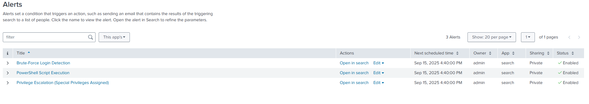
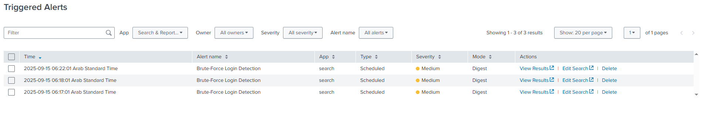

# 🚨 Splunk Alerts

This document summarizes the alerts configured in Splunk for the SOC Analyst Mini-Portfolio, including lab-friendly and real-world scenarios.

---

### 1️⃣ Alert Rules Overview


---

## 2️⃣ Brute-Force Login Detection (Scheduled)

Detects repeated failed login attempts, which could indicate password guessing or brute-force attacks.

- **SPL:**
```spl
index=* EventCode=4625
```

- **Lab Version (Testing Only):**
  - **Time Range:** Last 3 minutes  
  - **Schedule:** Run every 1 minute  
  - **Trigger Condition:** Number of Results >= 3  
  - **Notes:** Prevents locking test accounts during lab exercises.

- **Real-World Version:**
  - **Time Range:** Last 10–15 minutes  
  - **Schedule:** Run every 5–15 minutes (cron: `*/5 * * * *`)  
  - **Trigger Condition:** Account/IP with ≥5–10 failed logins  
  - **Notes:** Thresholds and time windows should be adapted to environment size and security policy.

- **Screenshot:**  


---

## 3️⃣ PowerShell Script Execution Alert (Real-Time)

Detects potentially malicious or suspicious PowerShell activity.

- **SPL:**
```spl
index=wineventlog 4104
```

- **Lab Version:**
  - **Time Range:** Real-time (per event)  
  - **Schedule:** Real-Time alert  
  - **Trigger Condition:** Any PowerShell script execution that matches known suspicious patterns
  - **Notes:** Captures PowerShell script execution in lab environment for demonstration.

- **Real-World Version:**
  - **Time Range:** Real-time  
  - **Schedule:** Real-Time alert  
  - **Trigger Condition:** Any PowerShell script execution that matches known suspicious patterns  
  - **Notes:** Filters can be applied to reduce false positives, e.g., exclude trusted admin scripts.

- **Screenshot:**  


---

## 4️⃣ Privilege Escalation (Special Privileges Assigned) (Real-Time)

Detects accounts granted administrative or special privileges (EventCode 4672).

- **SPL:**
```spl
index=main EventCode=4672
| search Account_Name!="SYSTEM"
```

- **Lab Version:**
  - **Time Range:** Real-time  
  - **Schedule:** Real-Time alert  
  - **Trigger Condition:** Any account granted special privileges  
  - **Notes:** Monitors admin logins in lab without flooding alerts for SYSTEM account.

- **Real-World Version:**
  - **Time Range:** Real-time  
  - **Schedule:** Real-Time alert  
  - **Trigger Condition:** Any account granted special privileges  
  - **Notes:** Exclude service accounts or known automated logins if necessary to reduce noise.

- **Screenshot:**  


---

### 💡 Tips for All Alerts
- Exclude known safe accounts or service accounts to reduce false positives.  
- Use **Splunk lookup tables** for whitelisting trusted IPs or users.  
- Adjust thresholds and time windows based on **environment size** and **risk tolerance**.  
- For lab demonstrations, keep time ranges and thresholds short to generate visible results quickly.  
- Use **real-time alerts** for single-event detections and **scheduled alerts** for cumulative events like brute-force attacks.
