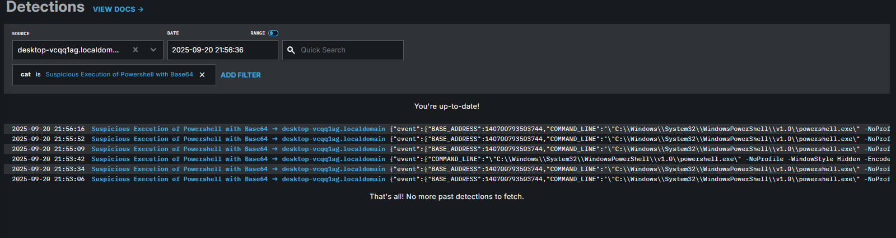
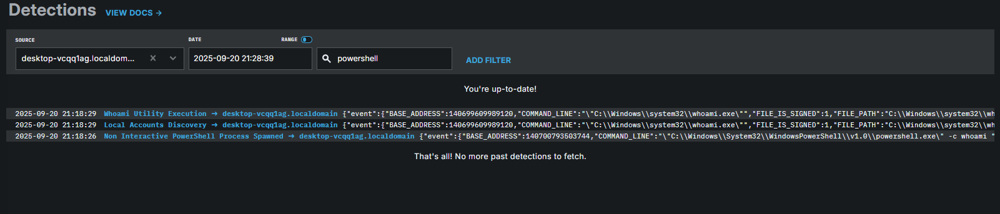
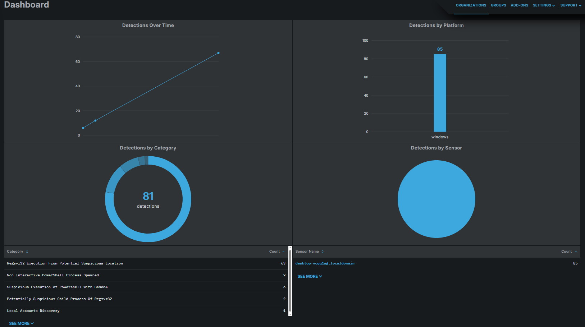

# LimaCharlie EDR Alerts

## 1️⃣ Malware / File Threat Detection

Detects execution of potentially harmful or suspicious files in the VM.

- **Sigma Rule Used:** `malicious_file_execution`  
- **Description:** Flags execution of known malicious files or lab-generated unsafe test files (e.g., EICAR or benign PE malware in isolated labs).  
- **Triggered By:** Running a test `.exe` or `.bat` in the isolated VM.  

- **Notes:**  
  - Always use an isolated VM for testing.  
  - For portfolio purposes, safe files like EICAR or lab-generated PUAs can be used.  
  - Focus on endpoint activity: filename, hash, path, timestamp.  

- **Screenshot:**  


- **Lab Tip:**  
  - Run the test file in the VM and capture the alert from LimaCharlie console.  

---

## 2️⃣ PowerShell Encoded Command Alert

Detects when PowerShell is launched with an encoded payload on the command line.

- **Rule Used:** *Suspicious Execution of PowerShell with Base64*  
- **Description:** Watches for `powershell.exe` or `pwsh.exe` started with flags such as `-e`, `-enc`, `-EncodedCommand`, indicating a possible obfuscated script execution.  
- **Severity:** Medium  
- **References:**  
  - [Atomic Red Team – T1059.001](https://github.com/redcanaryco/atomic-red-team/blob/f339e7da7d05f6057fdfcdd3742bfcf365fee2a9/atomics/T1059.001/T1059.001.md#atomic-test-20---powershell-invoke-known-malicious-cmdlets)  
  - [Palo Alto – EncodedCommand Attacks](https://unit42.paloaltonetworks.com/unit42-pulling-back-the-curtains-on-encodedcommand-powershell-attacks/)

### 💻 Lab Simulation

Run this harmless one-liner inside your **isolated** Windows VM:

```powershell
powershell.exe -NoProfile -NoExit -EncodedCommand VwByAGkAdABlAC0ATwB1AHQAcAB1AHQAIAAiAFQAZQBzAHQAIABEAGUAdABlAGMAdABpAG8AbgAiAA==
```

This launches PowerShell with an encoded string (“Test Detection”).  
The rule should trigger and produce an alert in LimaCharlie.

### 📸 Screenshot

Capture:

- The detection in **Detections → All Detections** (showing `powershell.exe` and `-EncodedCommand`).
- The process tree or event details.
- Optionally, the rule page highlighting that it fired.



> 💡 **Tip:** If no alert appears, confirm the rule is enabled, scope includes your host, and NEW_PROCESS events are reaching the cloud.


---

## 3️⃣ Privilege Escalation Alert (Admin / Special Privileges)

Detects when commands or processes are executed with elevated privileges using “RunAs”-like flags or administrative accounts.  

- **Sigma Rule Used:** `Suspicious RunAs-Like Flag Combination`  
- **Description:** Detects suspicious command-line flags that allow setting a target user and command (e.g., PsExec-like tools).  
- **Triggered By:** Actions such as running commands with `-u SYSTEM`, `-u NT`, `-u administrator`, or using `-c cmd / powershell / wscript / cscript`.  

- **Notes:**  
  - SYSTEM account logins are typically ignored.  
  - False positives are possible; this rule is medium severity.  
  - References: [Florian Roth / Nextron Systems](https://www.trendmicro.com/en_us/research/22/k/hack-the-real-box-apt41-new-subgroup-earth-longzhi.html)

- **Screenshot:**  


- **Lab Tip:**  
  - Simulate detection using a safe elevated command:  
    ```powershell
    Start-Process powershell -ArgumentList "-c whoami"
    ```
    
---

### 📊 Detection Dashboard Overview

Shows alert trends and event counts in real-time for key Sigma rules.



---

💡 **Tip:** Always highlight key fields like process name, user, file path, timestamp, and rule triggered.

---

## 4️⃣ Investigation & Response

Demonstrates a SOC workflow after detection and highlights real-world incident handling skills.

- **Triggered By:** Any alert from your lab (e.g., PowerShell encoded command, malware execution, privilege escalation).

- **Description:**  
  This section focuses on how a SOC analyst investigates and responds to alerts. The goal is to show a complete workflow from detection to containment, emphasizing critical thinking and decision-making.

- **Investigation Steps:**  
  1. **Open Alert Details:**  
     - Review the detection metadata: process name, command line, executing user, host, and timestamp.  
     - Note any unusual patterns or unexpected processes.  
  2. **Analyze Process Tree:**  
     - Explore parent-child relationships of processes to understand the origin and propagation of the suspicious activity.  
     - Identify which processes were spawned by the malicious or suspicious event.  
  3. **Check File & System Context:**  
     - Look at file paths, hashes, registry keys, or network connections involved.  
     - Determine whether any sensitive areas (Program Files, System32) were accessed or modified.  
  4. **Correlate with Other Alerts:**  
     - Compare the alert to other logged events on the same host or user to detect broader attack patterns.  
     - Identify lateral movement or privilege escalation attempts.  

- **Response Actions:**  
  1. **Containment:**  
     - Isolate the affected host from the network to prevent spread.  
     - Quarantine malicious files or scripts.  
  2. **Mitigation:**  
     - Terminate suspicious processes if safe to do so in the lab environment.  
     - Block or restrict suspicious scripts or executables using EDR policies.  
  3. **Documentation:**  
     - Record all observed behaviors, actions taken, and timestamps.  
     - Include notes on false positives or anomalies for learning purposes.  

- **Lab Tip:**  
  - Even when using safe files or simulated attacks, demonstrate the **full workflow**: detection → investigation → analysis → response.  
  - Highlight critical fields such as process name, user, command line, timestamp, and actions taken.  
  - Emphasize how you trace and contain the threat while minimizing impact on the lab environment.


