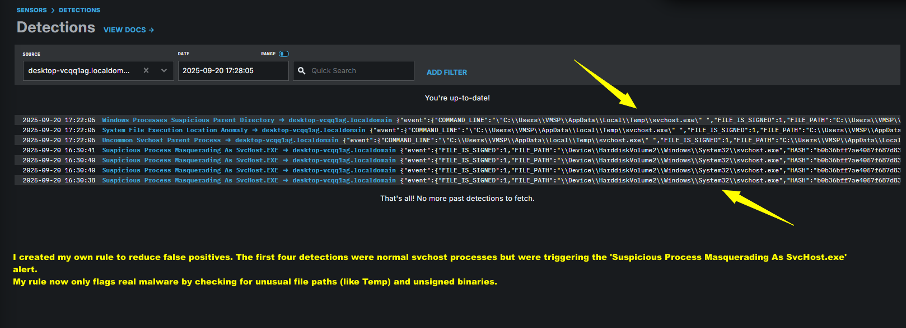

## My Custom Detection – Suspicious Process Masquerading as SvcHost.exe
A custom LimaCharlie rule created to avoid false positives while detecting processes pretending to be `svchost.exe`.  
This showcases tuning skills: refining detections to balance visibility and noise.

- **Purpose:** Detect suspicious processes masquerading as Windows Service Host (`svchost.exe`).  
- **Why Custom:** The default Sigma rule generated too many false positives; this custom logic narrows scope to unusual paths and command lines.  
- **Screenshot:**  

> 💡 **Tip:** Document *why* and *how* you tuned rules — hiring managers love seeing that you understand both detection and noise reduction.
