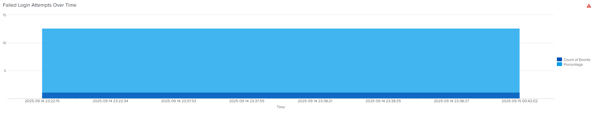
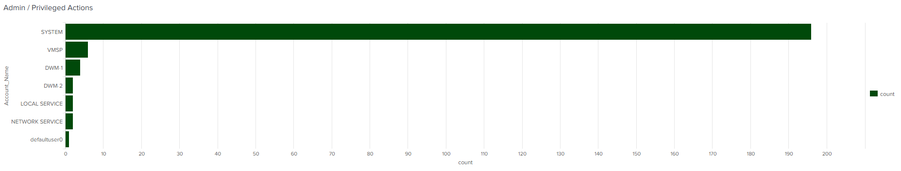
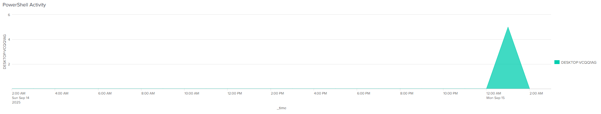
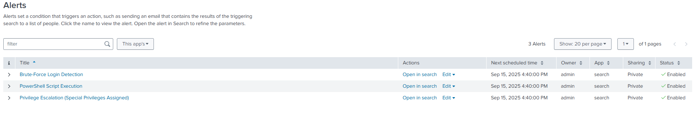
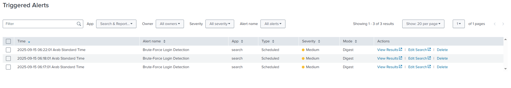
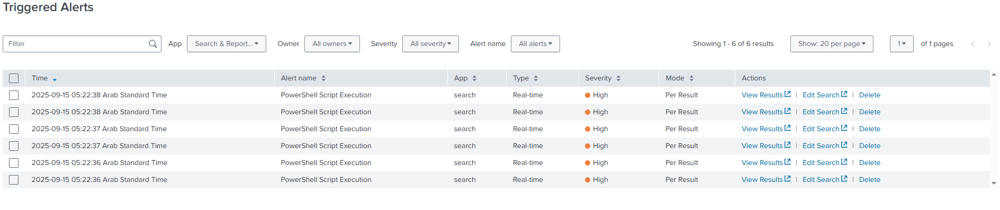
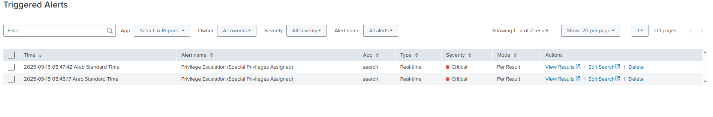

# 🔐 SOC Analyst Mini-Portfolio

Hands-on SOC analyst portfolio showcasing log analysis, detection queries, dashboards, and incident investigation reports.

---

## 📌 About
This repository is my **SOC Analyst Mini-Portfolio**, created to demonstrate practical, hands-on skills for entry-level SOC (Security Operations Center) roles.  

It contains:
- 🖥️ Splunk dashboards & reports built from simulated security events  
- 📄 Windows Security Event ID Cheat Sheet for quick reference  
- 🚀 Future projects with Sophos (EDR) & basic threat-hunting labs  

> 🎯 **Goal:** Show real-world log analysis, alerting, and investigation skills that go beyond theory.

---

## 📂 Contents
| Section | Description |
|---------|-------------|
| [**Splunk**](https://github.com/BlueWardRix/SOC-Analyst-Mini-Portfolio/tree/main/01-Splunk) | Dashboards, reports, and searches (e.g., failed login monitoring, PowerShell detection) |
| [**Cheatsheets**](https://github.com/BlueWardRix/SOC-Analyst-Mini-Portfolio/tree/main/02-Cheatsheets) | Windows Security Event ID cheat sheet and other quick references |
| [**Sophos (EDR)**](https://github.com/BlueWardRix/SOC-Analyst-Mini-Portfolio/tree/main/03-Sophos-EDR) | (Planned) Incident response & alert investigations |
| [**Screenshots**](https://github.com/BlueWardRix/SOC-Analyst-Mini-Portfolio/tree/main/04-Screenshots) | Visual evidence of dashboards, queries, and reports |

---

## 🖼️ Screenshots
---

## 🔍 Searching & Detecting
---
Before configuring alerts, I performed detailed log analysis in Splunk to identify suspicious activities and validate thresholds:

- **Failed Logins:** Tracked repeated failed logins per user/workstation (EventCode 4625).  
- **Privilege / Admin Actions:** Monitored EventCode 4672 to detect privilege escalation.  
- **PowerShell Activity:** Monitored EventCodes 4103 & 4104 to detect script execution.

---

### Top Security Event Codes

### Failed Logins Detection

### Admin / Privileged Actions

### PowerShell Activity Detection

---

### 🚨 Alert Screenshots
---
These alerts are configured in Splunk to automatically detect suspicious activities based on the log analysis performed in the Searching & Detecting phase.  

- **Brute-Force Login Alert:** Monitors repeated failed login attempts to identify potential account compromise.  
- **PowerShell Script Execution Alert:** Detects potentially malicious or suspicious PowerShell activity.  
- **Privilege Escalation Alert:** Flags administrative or special privilege logins for closer investigation.  

> These alerts demonstrate practical SOC workflows: detecting, correlating, and responding to security events in a lab environment.
---

### Alert Rules Overview

### Brute-Force Login Alert

### PowerShell Script Execution Alert

### Privilege Escalation Alert

---

## 📧 Contact
- **Email:** [BlueWardRix@gmail.com](mailto:BlueWardRix@gmail.com)  
- **GitHub:** [BlueWardRix](https://github.com/BlueWardRix)

> Feel free to reach out if you’d like to discuss my work or opportunities in SOC / cybersecurity.

---

### 💡 Notes
- This portfolio is for **learning and demonstration purposes** only.  
- All examples use **simulated or lab-generated data** — no real production data is included.

---
